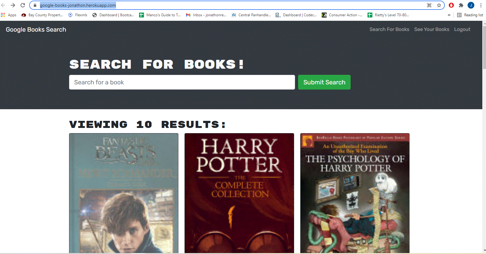

# 21 MERN: Book Search Engine

## Description

This was a refactoring of converting a book search with both log-in and sign-up functionality and calls to the Google Books API from just using Express, to utilizing GraphQL to make it more lightweight and efficient. 

Below is an example of the deployed project.

  

## Table of Contents 
* [License](#license)
* [Contribution](#contribution)
* [Questions](#questions)
* [Links](#links)
    
## License
This project is licensed under the mit license.
    
## Contribution 
    
Sole Contributor 

If you wish to make contributions, please contact me below, first.

## Questions
To contact me or report issues, please email me at jonathonrenaud1988@gmail.com

Go to https://github.com/RoomsieJones to view my github profile.    

## Links
[Link to repository!](https://github.com/roomsiejones/book-search)

[Link to Deployed Website!](https://google-books-jonathon.herokuapp.com/)

[LinkedIn](https://www.linkedin.com/in/jonathon-renaud-410910aa/)

[Resume](https://docs.google.com/document/d/1ub28BlsfOwQsW2EZ8ha5-XGSjncabLHVVOhax6jgi4w/edit?usp=sharing)

